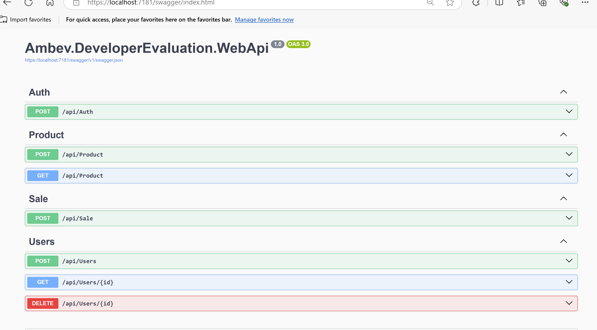

[Back to README](../README.md)

## Steps to Run

Add a global EF to project running `dotnet tool install --global dotnet-ef`


First, adjust your Docker Compose configuration in the project to ensure it works correctly.

Once the project is configured, you can run it using:
```sh
docker-compose up -d
```


You can use swagger or postman to test

https://localhost:7181/swagger/index.html





The services will start on your operating system.

If you are using Linux or macOS, remember to change the environment variable in Docker Compose to `HOME`, or keep it as is if you are using Windows.

## Entity Framework (EF)

For the project, it is necessary to set up the tables using EF migrations.

Run the following command inside the project directory:
```sh
cd src/Ambev.DeveloperEvaluation.WebApi
```
```sh
dotnet ef database update
```

After this, the tables will be initialized.

Inside the project, there is a warmup process that loads product tables from the fake `fakestoreapi`.

Simply start the project, and the tables will be created along with a generated product feed.

## Environments

- API: `localhost:8080`
  - Health Check: `8081`
- Database:
  - PostgreSQL: Port `5432`
  - Redis: Port `6379`
  - MongoDB: Port `27071`

